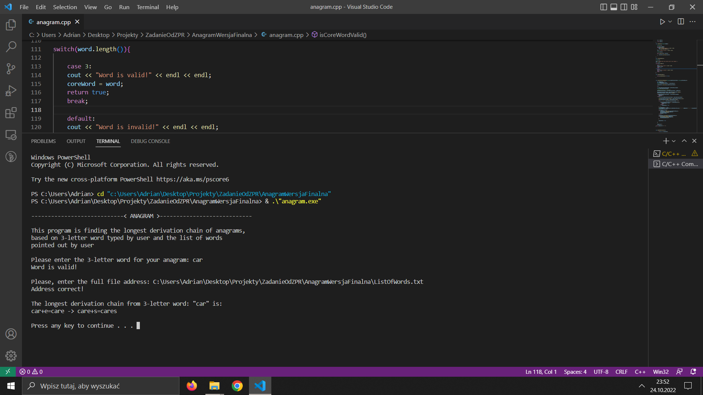

# Anagram

## Description

This program is finding the longest derivation chain of anagrams, based on 3-letter word typed by user and the list of words pointed out by user.

## Gallery

 
 
 
 The example of usage 

